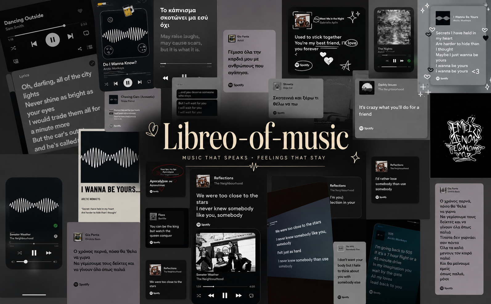

  

 

<h1 align="center">Giving Souls to Software</h1>

 

Libreo is built on the belief that software should carry meaning, emotion, and purpose.

Every tool has a purpose. Every creation deserves a soul.

<em>Where software is not only intelligent, but also thoughtful.</em>

Every line of code tells a story.

